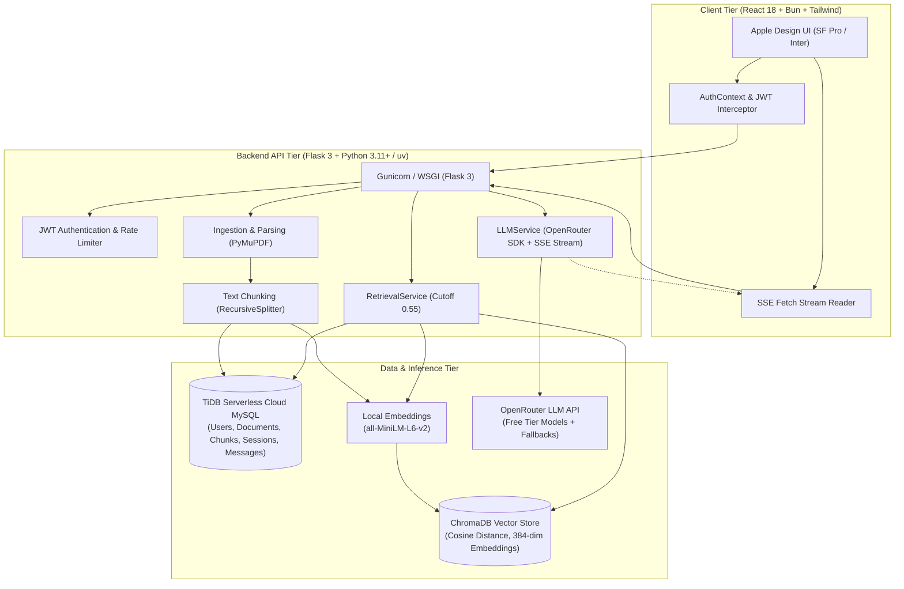

# DocChat

> **Grounded, strictly isolated document intelligence web application with zero hallucinations, verified inline citation chips, and real-time streaming answers.**

DocChat is a production-ready, full-stack Retrieval-Augmented Generation (RAG) platform built with **Python / Flask 3**, **TiDB Serverless (Cloud MySQL)**, **ChromaDB**, and **React 18 + Vite + Tailwind CSS**. Every response is mathematically grounded in indexed document excerpts with verifiable source citations.

---

## Architecture Overview



---

## Key Capabilities

- **Grounded Responses & Zero Hallucination Guarantee:** If retrieved excerpts do not meet the cosine distance threshold (`0.55`), the LLM call is completely short-circuited (Decision D4) and a standardized fallback message is returned.
- **Real-Time Token Streaming with Cancellation:** Real-time token delivery via Server-Sent Events (`POST /api/chat/sessions/<id>/messages/stream`). Streaming can be cancelled mid-generation; aborted responses leave no partial messages in the database (Decision D11).
- **Inline Citation Chips & Chunk Popovers:** Answers include numbered references (`[1]`, `[2]`) mapping to interactive citation chips (`filename · p.N`). Clicking a chip opens a popover displaying the exact retrieved chunk snippet and similarity score.
- **Strict Multi-Tenant Isolation:** All database queries and vector store operations are isolated by `user_id`. Attempting to access another user's documents or sessions yields an immediate `404 Not Found` (never leaking existence).
- **Hardened Security & Defenses:** File validation by extension and magic bytes (`%PDF`), random UUID file storage, 20 MB size limits, prompt injection defenses, and strict XSS neutralization via `react-markdown`.
- **Apple Design Language:** Adheres to Apple Human Interface Guidelines: `#0066cc` Action Blue, rounded pills, subtle hairline borders, responsive navigation down to 375px mobile viewports, and clean pulsing loading skeletons.

---

## 5-Command Quickstart Setup

Follow these 5 commands to spin up DocChat from a fresh clone:

### 1. Clone & Enter Repository
```bash
git clone https://github.com/your-username/DocChat.git && cd DocChat
```

### 2. Configure Backend Environment
```bash
cp backend/.env.example backend/.env
# Edit backend/.env to provide your TiDB/MySQL DATABASE_URL and OPENROUTER_API_KEY
```

### 3. Install Backend Dependencies & Run Database Migrations
```bash
cd backend && uv sync && uv run flask db upgrade
```

### 4. Start the Flask Backend Server
```bash
uv run python wsgi.py
```
*Backend runs at `http://localhost:5000` with live health check at `http://localhost:5000/api/health`.*

### 5. Start the React Frontend Application (in a new terminal)
```bash
cd frontend && bun install && bun run dev
```
*Frontend runs at `http://localhost:5173`.*

---

## Environment Variables Reference

All configurations are defined in `backend/app/config.py` and loaded from `backend/.env`:

| Variable | Default Value | Description |
|---|---|---|
| `FLASK_ENV` | `development` | Flask runtime environment (`development` or `production`) |
| `SECRET_KEY` | `dev-secret-key...` | Cryptographic secret for session cookies |
| `JWT_SECRET_KEY` | `dev-jwt-secret-key...` | Secret key for signing JWT access tokens |
| `JWT_ACCESS_MINUTES` | `60` | JWT access token validity in minutes |
| `DATABASE_URL` | `mysql+pymysql://...` | Connection URI for MySQL or TiDB Serverless |
| `UPLOAD_DIR` | `./storage/uploads` | Local directory for storing raw uploaded documents |
| `CHROMA_DIR` | `./storage/chroma` | Persistent directory for Chroma vector database |
| `MAX_UPLOAD_MB` | `20` | Maximum upload size per file in megabytes |
| `ALLOWED_EXTENSIONS` | `pdf,txt,md` | Comma-delimited list of accepted document types |
| `EMBEDDING_MODEL` | `sentence-transformers/all-MiniLM-L6-v2` | SentenceTransformer model for chunk embeddings |
| `CHUNK_SIZE` | `800` | Target character count per text chunk |
| `CHUNK_OVERLAP` | `150` | Character overlap between consecutive chunks |
| `TOP_K` | `5` | Maximum number of chunks retrieved per query turn |
| `MAX_DISTANCE` | `0.55` | Cosine distance cutoff threshold for retrieval grounding |
| `OPENROUTER_API_KEY` | `""` | OpenRouter API Key for free LLM inference |
| `LLM_MODEL` | `google/gemma-4-31b-it:free` | Primary LLM model identifier on OpenRouter |
| `LLM_FALLBACK_MODELS` | `nvidia/nemotron-3-super:free` | Fallback model identifiers separated by commas |
| `ALLOW_PAID_MODELS` | `false` | Safeguard to reject non-`:free` models and prevent accidental spend |
| `FRONTEND_ORIGIN` | `http://localhost:5173` | Allowed CORS origin |

---

## Running Test Suites

### 1. Backend Automated Tests (85 tests, 94% Coverage)
```bash
cd backend
uv run pytest -v
```
To run tests with code coverage reporting:
```bash
uv run pytest --cov=app --cov-report=term-missing
```

### 2. Frontend Automated Tests (18 tests)
```bash
cd frontend
bun run test
```
To run production build and lint checks:
```bash
bun run build && bun run lint
```

### 3. End-to-End Smoke Test
Run the automated end-to-end smoke verification against a running instance:
```bash
# Using Python
uv run --project backend python scripts/smoke_test.py --base-url http://localhost:5000

# Or using Shell script
bash scripts/smoke_test.sh
```

---

## Utility Scripts

- **`scripts/check_llm.py`:** Tests connection and latency for configured OpenRouter primary and fallback models.
  ```bash
  uv run --project backend python scripts/check_llm.py
  ```
- **`scripts/reindex.py`:** Rebuilds the Chroma vector store directly from MySQL/TiDB `chunks` table if vector storage is ever deleted or corrupted.
  ```bash
  uv run --project backend python scripts/reindex.py --batch-size 50
  ```
- **`scripts/smoke_test.py`:** Full-lifecycle integration test covering registration, document upload, status polling, retrieval, non-streaming chat, SSE streaming chat, and cascade deletion.

---

## Troubleshooting Guide

### 1. Database Connection Failure (`OperationalError` or SSL errors)
- **TiDB Serverless:** TiDB requires SSL connections. Ensure your connection string includes `?ssl_verify_cert=true` or SSL CA parameters.
- **Port:** TiDB Serverless connects on port `4000`, not standard `3306`.
- **Database creation:** Ensure the database exists: `CREATE DATABASE docchat CHARACTER SET utf8mb4;`.

### 2. LLM Provider Errors (`LLM_UNAVAILABLE` / 429)
- Free tier models on OpenRouter occasionally hit rotation limits or congestion.
- DocChat automatically retries up to 3 times and switches to fallback models (`LLM_FALLBACK_MODELS`).
- Check active model health with `python scripts/check_llm.py`.

### 3. Documents Stuck in `processing`
- If the server restarts during an active ingestion, DocChat automatically resets any interrupted documents to `failed` with status message `"Interrupted by restart"` upon boot.
- Users can delete or re-upload the file directly from the UI.

### 4. Vector Store Rebuilding
- If the `storage/chroma` directory is removed or corrupted, run:
  ```bash
  uv run --project backend python scripts/reindex.py
  ```
  The script reads all `ready` documents and chunks from MySQL, generates new embeddings, and restores Chroma with zero data loss.

---

## License

MIT License. Built with strict grounding and data isolation.
